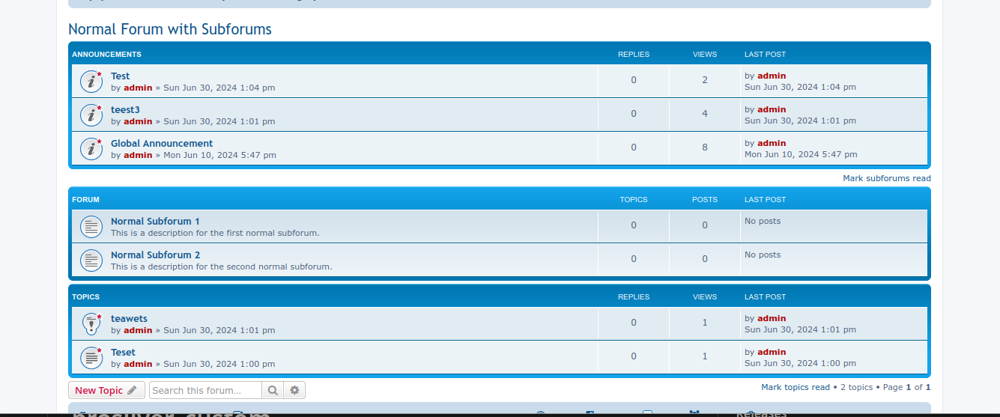

# prosilver_custom

Custom style that moves viewforum_body.html around:

* Announcements
* Subforum
* Topics

Create `prosilver_custom` folder in the styles folder and place the files in it. If you use a style other than prosilver, then open the style.cfg and change ``parent =`` to the correct style. Then make prosilver_custom your default style. The viewforum_body.html in prosilver_custom will override the one in the parent style.

